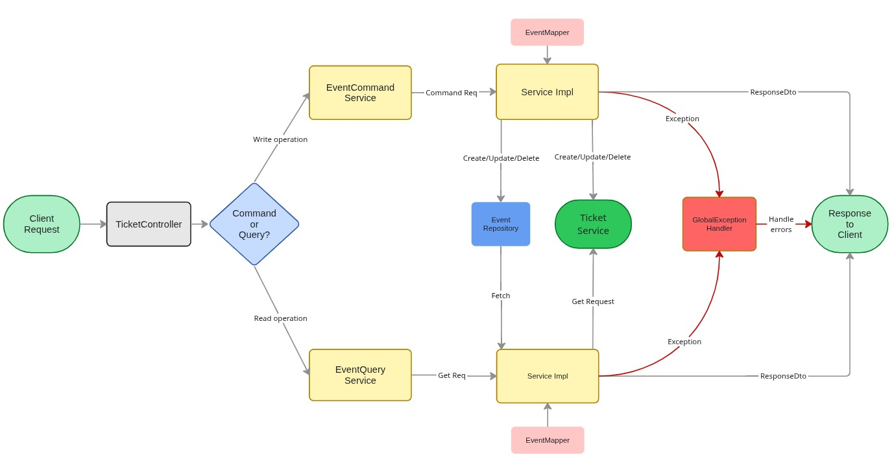

# Event Service — EventForge Microservice

The **Event Service** is a core **microservice** within the EventForge ecosystem responsible for managing the **event lifecycle**. It provides backend APIs for **creating, updating, publishing, and retrieving events**, and acts as the source of truth for event-related data.

---

## Features

- **Event Management:** Create, update, and retrieve events.
- **Event Lifecycle:** Supports draft, published, and closed event states.
- **Public Events:** Exposes published events for discovery and ticketing.
- **Sales Window Control:** Manages event start/end dates and ticket sale periods.



---

## Database Design

The **Event Service database** stores all event-related metadata and lifecycle state.
It does **not manage tickets directly**, but provides event references used by other services like Ticket and Payment.

Key entities:

- `Event`: Core event details such as name, venue, description, and dates.
- `EventStatus`: Represents the lifecycle state of an event (DRAFT, PUBLISHED, CLOSED).

[ EventForge Full Architecture Design](https://miro.com/app/board/uXjVGVq5l3U=/?moveToWidget=3458764653985736600&cot=14)

---

## API Endpoints

Events

| Method     | Endpoint             | Description            |
| ---------- | -------------------- | ---------------------- |
| **POST**   | `/events`            | Create a new event     |
| **GET**    | `/events/{event_id}` | Retrieve event details |
| **PATCH**  | `/events/{event_id}` | Update event details   |
| **DELETE** | `/events/{event_id}` | Delete an event        |

Public Events

| Method  | Endpoint                       | Description                 |
| ------- | ------------------------------ | --------------------------- |
| **GET** | `/events/published`            | List all published events   |
| **GET** | `/events/published/{event_id}` | Get published event details |

---

## Tech Stack

- **Backend:** Spring Boot (Java 17+)
- **Build Tool:** Gradle
- **Database:** PostgreSQL
- **Containerization:** Docker
- **Deployment:** Dockerized microservice setup (Planned)

---

## Running Locally

Requirements:

- Git
- Java 17+
- Gradle (wrapper included)
- Docker & Docker Compose

```bash
# Clone the repository
git clone https://github.com/mukuldaroch/event-service.git
cd event-service
```

### Add auth.local to your hosts file

Keycloak is exposed using a custom hostname (`auth.local`).
Add this to your system hosts file:

```bash
sudo vim /etc/hosts
```

Add:

```bash
127.0.0.1   auth.local
```

This allows:

```
http://auth.local:8080
```

### Start PostgreSQL and Docker network

Bring up the database and shared network:

```bash
docker compose up -d
```

This will create:

- `event-database` (Postgres)
- `event-mesh` (Docker network)

### Run Keycloak

Start Keycloak inside the same Docker network:

```bash
docker run -d \
  --name keycloak \
  --network event-mesh \
  --add-host auth.local:host-gateway \
  -p 8080:8080 \
  -e KC_HOSTNAME=auth.local \
  -e KC_HOSTNAME_STRICT=false \
  -e KC_HTTP_ENABLED=true \
  -e KC_BOOTSTRAP_ADMIN_USERNAME=admin \
  -e KC_BOOTSTRAP_ADMIN_PASSWORD=admin \
  -v keycloak-data:/opt/keycloak/data \
  quay.io/keycloak/keycloak:latest \
  start-dev
```

After this, Keycloak will be available at:

```
http://auth.local:8080
```

### Keycloak Setup (Required)

After Keycloak starts, open:

```bash
http://auth.local:8080
```

**Login with:**

- username: admin
- password: admin

**Create Realm**

Realm name: event-service

**Create Client (API)**

Client ID: event-api
Client type: OpenID Connect

Enable:

```
Client authentication: ON
Authorization:         OFF
Standard flow:         OFF
Direct access grants:  OFF
Service accounts:      ON
```

This makes event-api a confidential machine-to-machine client.

**Get Client Secret**

Copy the Client Secret
Put this value into your docker run:

```bash
# This is how your Event Service proves its identity to Keycloak.
-e keycloak.credentials.secret=YOUR_CREDENTIAL_SECRET_HERE
```

**Create Realm Roles**

Create:
These map to how your system works.

```
ORGANIZER
ATTENDEE
STAFF
```

**Create User**

Example:

```
Username: bro
Email verified: true
Enabled: true
```

## Run `bash run.sh` to build automatically or build manually by following these steps

### Build the Spring Boot JAR

```bash
./gradlew clean build
```

### Build and run the Event Service container

Remove any old container:

```bash
docker rm -f event-service 2>/dev/null || true
```

Build image:

```bash
docker build -t event-service .
```

Run the service:

```bash
docker run -d \
    --name event-service \
    --network event-mesh \
    --add-host auth.local:host-gateway \
    -p 8083:8083 \
    -e SPRING_DATASOURCE_URL=jdbc:postgresql://event-database:5432/eventdb \
    -e SPRING_DATASOURCE_USERNAME=postgres \
    -e SPRING_DATASOURCE_PASSWORD=daroch \
    -e SPRING_SECURITY_OAUTH2_RESOURCESERVER_JWT_ISSUER_URI=http://auth.local:8080/realms/event-service \
    -e keycloak.client-id=event-api \
    -e keycloak.credentials.secret=YOUR_CREDENTIAL_SECRET_HERE \
    event-service
```

The service will be available at:

```
http://localhost:8083
```

---

## 👨‍💻 Author

- [@Mukul Daroch](https://github.com/mukuldaroch)
