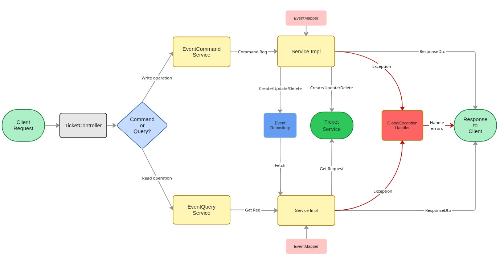

# Event Service — EventForge Microservice

The **Event Service** is a core **microservice** within the EventForge ecosystem responsible for managing the **event lifecycle**. It provides backend APIs for **creating, updating, publishing, and retrieving events**, and acts as the source of truth for event-related data.

---

## Features

- **Event Management:** Create, update, and retrieve events.
- **Event Lifecycle:** Supports draft, published, and closed event states.
- **Public Events:** Exposes published events for discovery and ticketing.
- **Sales Window Control:** Manages event start/end dates and ticket sale periods.



---

## Database Design

The **Event Service database** stores all event-related metadata and lifecycle state.
It does **not manage tickets directly**, but provides event references used by other services like Ticket and Payment.

Key entities:

- `Event`: Core event details such as name, venue, description, and dates.
- `EventStatus`: Represents the lifecycle state of an event (DRAFT, PUBLISHED, CLOSED).

## [ EventForge Full Architecture Design](https://miro.com/app/board/uXjVGVq5l3U=/?moveToWidget=3458764653985736600&cot=14)

---

## API Endpoints

Events

| Method     | Endpoint             | Description            |
| ---------- | -------------------- | ---------------------- |
| **POST**   | `/events`            | Create a new event     |
| **GET**    | `/events/{event_id}` | Retrieve event details |
| **PATCH**  | `/events/{event_id}` | Update event details   |
| **DELETE** | `/events/{event_id}` | Delete an event        |

Public Events

| Method  | Endpoint                       | Description                 |
| ------- | ------------------------------ | --------------------------- |
| **GET** | `/events/published`            | List all published events   |
| **GET** | `/events/published/{event_id}` | Get published event details |

---

## Tech Stack

- **Backend:** Spring Boot (Java 17+)
- **Build Tool:** Gradle
- **Database:** PostgreSQL
- **Containerization:** Docker
- **Deployment:** Dockerized microservice setup

---

## Running Event Service Locally

## 1) Prerequisites

You need:

- Git
- Java 17+
- Gradle (wrapper included)
- Docker

## 2) Install Required Tools

### Arch-based (pacman)

```bash
sudo pacman -Syu
sudo pacman -S jdk17-openjdk gradle docker docker-compose postgresql pgcli
```

Enable Docker:

```bash
sudo systemctl enable docker
sudo systemctl start docker
```

### Debian-based (apt)

```bash
sudo apt update
sudo apt install -y openjdk-17-jdk gradle docker.io docker-compose postgresql-client pgcli
```

Enable Docker:

```bash
sudo systemctl enable docker
sudo systemctl start docker
```

## 3) Clone the Repository

```bash
git clone https://github.com/mukuldaroch/event-service.git
cd event-service
```

## 4) Configure Local Hostname for Keycloak

Keycloak is exposed using a custom hostname:

```
auth.local
```

Edit your hosts file:

```bash
sudo vim /etc/hosts
```

Add:

```
127.0.0.1   auth.local
```

Now Keycloak will be accessible at:

```
http://auth.local:8080
```

## 5) Start Infrastructure (PostgreSQL + Network)

Start database and shared Docker network:

```bash
docker compose up -d
```

This creates:

- `event-database` (PostgreSQL)
- `event-mesh` (Docker network)

## 6) Start Redis (Required for Caching / Future Features)

Run Redis inside the same Docker network:

```bash
docker run -d \
  --name redis \
  --network event-mesh \
  -p 6379:6379 \
  redis:latest
```

Redis will be available at:

```
localhost:6379
```

If your Spring Boot app uses Redis, you’ll configure:

```
SPRING_REDIS_HOST=redis
SPRING_REDIS_PORT=6379
```

## 7) Start Keycloak

Run Keycloak in the same Docker network:

```bash
docker run -d \
  --name keycloak \
  --network event-mesh \
  --add-host auth.local:host-gateway \
  -p 8080:8080 \
  -e KC_HOSTNAME=auth.local \
  -e KC_HOSTNAME_STRICT=false \
  -e KC_HTTP_ENABLED=true \
  -e KC_BOOTSTRAP_ADMIN_USERNAME=admin \
  -e KC_BOOTSTRAP_ADMIN_PASSWORD=admin \
  -v keycloak-data:/opt/keycloak/data \
  quay.io/keycloak/keycloak:latest \
  start-dev
```

Access Keycloak:

```
http://auth.local:8080
```

Login:

```
Username: admin
Password: admin
```

## 8) Configure Keycloak

### 8.1 Create Realm

```
Realm Name: event-service
```

### 8.2 Create Client (Machine-to-Machine)

```
Client ID: event-api
Client Type: OpenID Connect
```

Enable:

```
Client authentication: ON
Authorization: OFF
Standard flow: OFF
Direct access grants: OFF
Service accounts: ON
```

This makes it a confidential client.

### 8.3 Copy Client Secret

Get the **Client Secret** from:

```
Clients → event-api → Credentials
```

You’ll use this when running Event Service.

### 8.4 Create Realm Roles

Create:

```
ORGANIZER
ATTENDEE
STAFF
```

### 8.5 Create User

Example:

```
Username: bro
Email verified: true
Enabled: true
```

Assign roles as needed.

## 9) Build the Application

If on Linux/macOS:

```bash
./gradlew clean build
```

## 10) Build and Run Event Service Container

Remove old container:

```bash
docker rm -f event-service 2>/dev/null || true
```

Build Docker image:

```bash
docker build -t event-service .
```

Run container:

```bash
docker run -d \
  --name event-service \
  --network event-mesh \
  --add-host auth.local:host-gateway \
  -p 8083:8083 \
  -e SPRING_DATASOURCE_URL=jdbc:postgresql://event-database:5432/eventdb \
  -e SPRING_DATASOURCE_USERNAME=postgres \
  -e SPRING_DATASOURCE_PASSWORD=daroch \
  -e SPRING_SECURITY_OAUTH2_RESOURCESERVER_JWT_ISSUER_URI=http://auth.local:8080/realms/event-service \
  -e keycloak.client-id=event-api \
  -e keycloak.credentials.secret=YOUR_CREDENTIAL_SECRET_HERE \
  -e SPRING_REDIS_HOST=redis \
  -e SPRING_REDIS_PORT=6379 \
  event-service
```

## 11) Access Services

| Service       | Container Name | Port                          | Access URL                                       |
| ------------- | -------------- | ----------------------------- | ------------------------------------------------ |
| Keycloak      | keycloak       | 8080                          | [http://auth.local:8080](http://auth.local:8080) |
| Event Service | event-service  | 8083                          | [http://localhost:8083](http://localhost:8083)   |
| PostgreSQL    | event-database | 5432 (internal) / 5433 (host) | localhost:5433                                   |
| Redis         | redis          | 6379                          | localhost:6379                                   |

---

## 📜 Viewing Logs

View logs for any service using:

```bash
docker logs -f keycloak
docker logs -f event-service
docker logs -f event-database
```

`-f` streams logs live (like `tail -f`).

---

## 🗄️ Connecting to PostgreSQL

The Event Service database is exposed on **port 5433** on your host.

Connect using `pgcli`:

```bash
pgcli -h localhost -p 5433 -U postgres -d eventdb
```

Password:

```
daroch
```

This lets you inspect tables, rows, and migrations in real time.

---

# 🧱 Event-Service Project Structure

This service follows a **layered, domain-driven structure** optimized for microservices, Spring Boot, and long-term sanity.

The idea is simple:
**controllers talk to services → services talk to repositories → repositories talk to the database**

### Root Package

```
com.daroch.event
```

---

### ⚙️ `config/`

Infrastructure lives here.

```
config/
├── JpaConfiguration.java
├── SecurityConfig.java
└── securityconfig.md
```

This folder wires the service to the outside world.

- `JpaConfiguration`
  Enables auditing, transactions, and Hibernate magic.

- `SecurityConfig`
  Defines how JWT, OAuth2, and request authorization works.

- `securityconfig.md`
  Human-readable explanation of why the security setup exists and how it works.

---

### 🧬 `domain/`

This is the **truth of the system**.

```
domain/
├── entities/
│   ├── Event.java
│   └── ERD.md
└── enums/
    ├── EventStatusEnum.java
    └── UserType.java
```

- `Event.java`
  The **actual event** as the database sees it.

- `EventStatusEnum`
  PUBLISHED, DRAFT, CANCELLED etc — the lifecycle of an event.

- `ERD.md`
  Documents how tables and relationships look in the database.

This layer contains no controllers, no DTOs, no APIs.
Only **business objects**.

---

### 📦 `dto/`

The **wire format** of your API.

```
dto/
├── request/
├── response/
├── ErrorDto.java
└── dtos.md
```

DTOs exist so your API does not leak database entities.

- `request/`
  What clients send in (`CreateEventRequest`, `UpdateEventRequest`)

- `response/`
  What clients receive (`EventResponse`, `PublishedEventResponse`)

- `ErrorDto`
  Standard error format across the API.

Entities ≠ API contracts.
DTOs protect your database from frontend stupidity and versioning hell.

---

## 🔁 `mappers/`

```
mappers/
└── EventMapper.java
```

Converts:

- DTO → Entity
- Entity → DTO

So controllers never touch entities directly and services never touch API objects.

---

## 🗄️ `repositories/`

```
repositories/
└── EventRepository.java
```

Spring Data JPA interface.

---

## 🧠 `services/`

Where the **actual business logic** lives.

```
services/
├── commands/
│   ├── CreateEventCommand.java
│   └── UpdateEventCommand.java
├── EventCommandService.java
├── EventQueryService.java
└── impl/
    ├── EventCommandServiceImpl.java
    └── EventQueryServiceImpl.java
```

This follows **CQRS** (Command Query Responsibility Segregation):

- **Command Services** → change state
  (create, update, delete)

- **Query Services** → read state
  (get event, list events)

---

## 🧨 `exceptions/`

```
exceptions/
├── EventNotFoundException.java
├── EventTicketException.java
└── EventUpdateException.java
```

These are domain-level failures.

Controllers never throw `RuntimeException` or `NullPointerException`.
They throw **meaningful business errors** that get mapped to HTTP responses.

---

### 📄 `resources/`

```
resources/
├── application.yaml
├── application-dev.yaml
└── application-docker.yaml
```

Environment-specific configuration:

- `application.yaml` → shared defaults
- `application-dev.yaml` → local machine
- `application-docker.yaml` → containers

This allows the same code to run:

- locally
- in Docker
- in production

---

### 🌍 `controllers/`

The **HTTP boundary** of the microservice.

```
controllers/
├── EventController.java
└── GlobalExceptionHandler.java
```

- `EventController`
  Exposes REST endpoints like
  `POST /events`, `GET /events/{id}`, `PUT /events/{id}`

    It does:
    - JWT → User ID extraction
    - Request → DTO mapping
    - Delegates to services

    It **never**:
    - Talks to the database
    - Knows how entities are stored
    - Contains business rules

- `GlobalExceptionHandler`
  Converts internal exceptions into clean HTTP error responses.

---

## Final Architecture

This service is built like a real microservice:

- Controllers are dumb
- Services are smart
- Entities are pure
- DTOs protect the API
- Repositories touch the database
- Security is isolated
- Configuration is externalized

Nothing leaks.
Nothing becomes unmaintainable when the system grows.

---

## 👨‍💻 Author

- [@Mukul Daroch](https://github.com/mukuldaroch)
